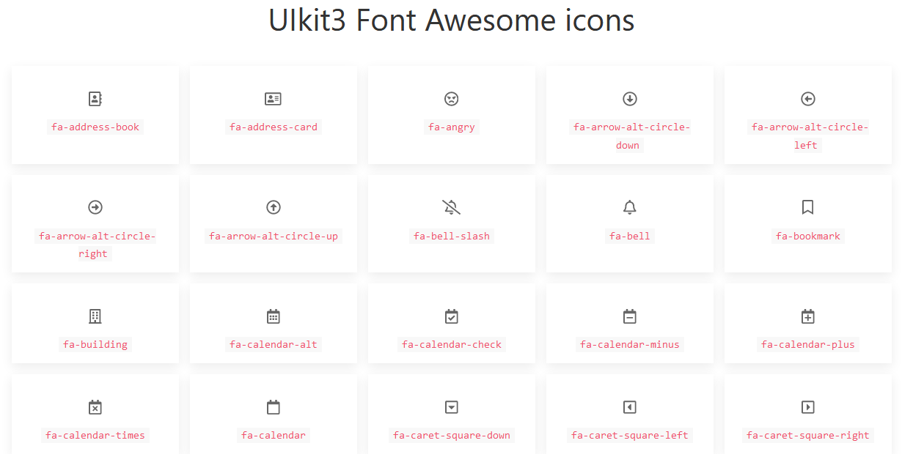

# UIkit3 Font Awesome icons
* Icons available: 1343
* Font Awesome Version: 5.3.1
* [Icons List](ICONSLIST.md)
* Grid size: 20px
* SVG files generated with awesome [icomoon.io](https://icomoon.io)

## License
* `uikit-fa-icons` is distributed under the MIT license.
* The original Font Awesome font license is [SIL OFL 1.1](http://fontawesome.io/license/)

The original Font Awesome icon font created by [Dave Gandy](http://twitter.com/davegandy) can be found at http://fontawesome.io

## Demo
